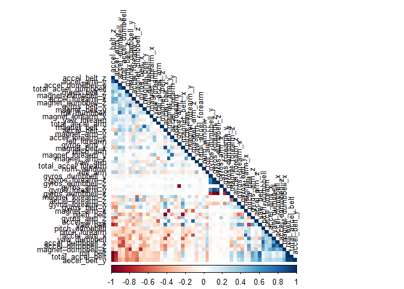
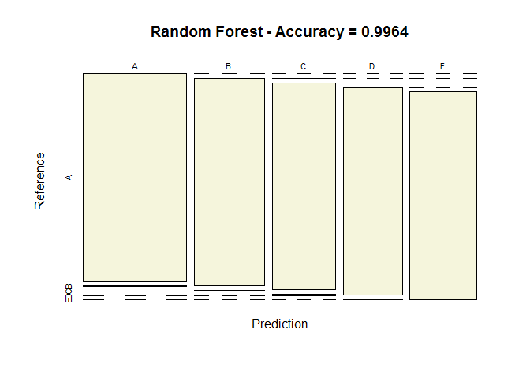
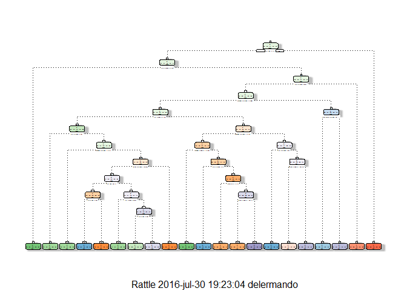
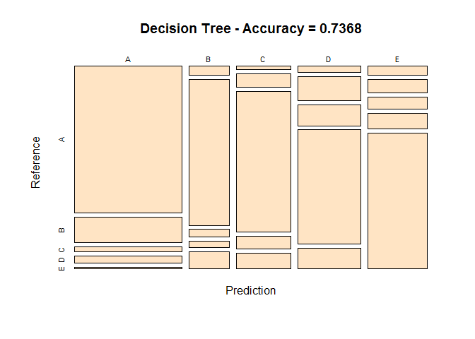
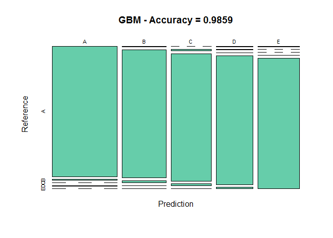

Executive Summary
-----------------

This document presents the results of the Practical Machine Learning
Peer Assessments in a report using a single R markdown document that can
be processed by knitr and be transformed into an HTML file. This
analysis was done to predict the manner in which the subjects performed
weight lifting exercises. The data is collected from accelerometers on
the belt, forearm, arm, and dumbell of 6 participants. The outcome
variable has five classes and the total number of predictors are 159.

### Preparation

The warnings messages was keept for research reproducibility purpose

    library(knitr)
    library(caret)

    ## Warning: package 'caret' was built under R version 3.3.1

    ## Loading required package: lattice

    ## Loading required package: ggplot2

    library(rpart)

    ## Warning: package 'rpart' was built under R version 3.3.1

    library(rpart.plot)

    ## Warning: package 'rpart.plot' was built under R version 3.3.1

    library(randomForest)

    ## Warning: package 'randomForest' was built under R version 3.3.1

    ## randomForest 4.6-12

    ## Type rfNews() to see new features/changes/bug fixes.

    ## 
    ## Attaching package: 'randomForest'

    ## The following object is masked from 'package:ggplot2':
    ## 
    ##     margin

    library(corrplot)

    ## Warning: package 'corrplot' was built under R version 3.3.1

    library(rattle)

    ## Warning: package 'rattle' was built under R version 3.3.1

    ## Rattle: A free graphical interface for data mining with R.
    ## Version 4.1.0 Copyright (c) 2006-2015 Togaware Pty Ltd.
    ## Type 'rattle()' to shake, rattle, and roll your data.

    set.seed(12345)

### Loading Data

The training data for this project are downloaded from
[here](https://d396qusza40orc.cloudfront.net/predmachlearn/pml-training.csv)

The test data are downloaded from
[here](https://d396qusza40orc.cloudfront.net/predmachlearn/pml-testing.csv)

The data for this project come from this
[source](http://groupware.les.inf.puc-rio.br/har)

    training <- read.csv("pml-training.csv")
    testing <- read.csv("pml-testing.csv")
    inTrain  <- createDataPartition(training$classe, p=0.7, list=FALSE)
    TrainSet <- training[inTrain, ]
    TestSet  <- training[-inTrain, ]

The next step is loading the dataset from the URL provided above. The
training dataset is then partinioned in 2 to create a Training set (70%
of the data) for the modeling process and a Test set (with the remaining
30%) for the validations. The testing dataset is not changed and will
only be used for the quiz results generation

### Preprocessing

    NZV <- nearZeroVar(TrainSet)
    TrainSet <- TrainSet[, -NZV]
    TestSet  <- TestSet[, -NZV]
    dim(TrainSet); dim(TestSet)

    ## [1] 13737   106

    ## [1] 5885  106

### Data Cleaning

Remove variables with missing values

    AllNA    <- sapply(TrainSet, function(x) mean(is.na(x))) > 0.95
    TrainSet <- TrainSet[, AllNA==FALSE]
    TestSet  <- TestSet[, AllNA==FALSE]
    dim(TrainSet)

    ## [1] 13737    59

### Remove unnecessary columns

    TrainSet <- TrainSet[, -(1:5)]
    TestSet  <- TestSet[, -(1:5)]
    dim(TrainSet); dim(TestSet)

    ## [1] 13737    54

    ## [1] 5885   54

Verifying Correlation Analysis

    corMatrix <- cor(TrainSet[, -54])
    corrplot(corMatrix, order = "FPC", method = "color", type = "lower", 
             tl.cex = 0.8, tl.col = rgb(0, 0, 0))

Modeling - Prediction Model Building
------------------------------------

Since a random forest model is chosen and the data set must first be
checked on possibility of columns without data.

The decision is made whereby all the columns that having less than 60%
of data filled are removed.

In the new training set and validation set we just created, there are 52
predictors and 1 response. Check the correlations between the predictors
and the outcome variable in the new training set. There doesn't seem to
be any predictors strongly correlated with the outcome variable, so
linear regression model may not be a good option. Random forest model
may be more robust for this data.

### Random Forest Model

Just try to fit a random forest model and check the model performance on
the validation set.

    set.seed(12345)
    controlRF <- trainControl(method="cv", number=3, verboseIter=FALSE)
    modFitRandForest <- train(classe ~ ., data=TrainSet, method="rf",
                              trControl=controlRF)
    modFitRandForest$finalModel

    ## 
    ## Call:
    ##  randomForest(x = x, y = y, mtry = param$mtry) 
    ##                Type of random forest: classification
    ##                      Number of trees: 500
    ## No. of variables tried at each split: 27
    ## 
    ##         OOB estimate of  error rate: 0.2%
    ## Confusion matrix:
    ##      A    B    C    D    E  class.error
    ## A 3904    1    0    0    1 0.0005120328
    ## B    5 2652    1    0    0 0.0022573363
    ## C    0    5 2390    1    0 0.0025041736
    ## D    0    0    7 2245    0 0.0031083481
    ## E    0    1    0    5 2519 0.0023762376

Predict on test dataset

    predictRandForest <- predict(modFitRandForest, newdata=TestSet)
    confMatRandForest <- confusionMatrix(predictRandForest, TestSet$classe)
    confMatRandForest

    ## Confusion Matrix and Statistics
    ## 
    ##           Reference
    ## Prediction    A    B    C    D    E
    ##          A 1674    5    0    0    0
    ##          B    0 1133    4    0    0
    ##          C    0    1 1022    8    0
    ##          D    0    0    0  956    3
    ##          E    0    0    0    0 1079
    ## 
    ## Overall Statistics
    ##                                           
    ##                Accuracy : 0.9964          
    ##                  95% CI : (0.9946, 0.9978)
    ##     No Information Rate : 0.2845          
    ##     P-Value [Acc > NIR] : < 2.2e-16       
    ##                                           
    ##                   Kappa : 0.9955          
    ##  Mcnemar's Test P-Value : NA              
    ## 
    ## Statistics by Class:
    ## 
    ##                      Class: A Class: B Class: C Class: D Class: E
    ## Sensitivity            1.0000   0.9947   0.9961   0.9917   0.9972
    ## Specificity            0.9988   0.9992   0.9981   0.9994   1.0000
    ## Pos Pred Value         0.9970   0.9965   0.9913   0.9969   1.0000
    ## Neg Pred Value         1.0000   0.9987   0.9992   0.9984   0.9994
    ## Prevalence             0.2845   0.1935   0.1743   0.1638   0.1839
    ## Detection Rate         0.2845   0.1925   0.1737   0.1624   0.1833
    ## Detection Prevalence   0.2853   0.1932   0.1752   0.1630   0.1833
    ## Balanced Accuracy      0.9994   0.9969   0.9971   0.9955   0.9986

Ploting Matrix Results to Random Forest Model

    plot(confMatRandForest$table, col = "beige",
         main = paste("Random Forest - Accuracy =",
                      round(confMatRandForest$overall['Accuracy'], 4)))

### Decision Trees Method

    set.seed(12345)
    modFitDecTree <- rpart(classe ~ ., data=TrainSet, method="class")
    suppressWarnings(fancyRpartPlot(modFitDecTree))

Again, Predict on test dataset

    predictDecTree <- predict(modFitDecTree, newdata=TestSet, type="class")
    confMatDecTree <- confusionMatrix(predictDecTree, TestSet$classe)
    confMatDecTree

    ## Confusion Matrix and Statistics
    ## 
    ##           Reference
    ## Prediction    A    B    C    D    E
    ##          A 1530  269   51   79   16
    ##          B   35  575   31   25   68
    ##          C   17   73  743   68   84
    ##          D   39  146  130  702  128
    ##          E   53   76   71   90  786
    ## 
    ## Overall Statistics
    ##                                          
    ##                Accuracy : 0.7368         
    ##                  95% CI : (0.7253, 0.748)
    ##     No Information Rate : 0.2845         
    ##     P-Value [Acc > NIR] : < 2.2e-16      
    ##                                          
    ##                   Kappa : 0.6656         
    ##  Mcnemar's Test P-Value : < 2.2e-16      
    ## 
    ## Statistics by Class:
    ## 
    ##                      Class: A Class: B Class: C Class: D Class: E
    ## Sensitivity            0.9140  0.50483   0.7242   0.7282   0.7264
    ## Specificity            0.9014  0.96650   0.9502   0.9100   0.9396
    ## Pos Pred Value         0.7866  0.78338   0.7543   0.6131   0.7305
    ## Neg Pred Value         0.9635  0.89051   0.9422   0.9447   0.9384
    ## Prevalence             0.2845  0.19354   0.1743   0.1638   0.1839
    ## Detection Rate         0.2600  0.09771   0.1263   0.1193   0.1336
    ## Detection Prevalence   0.3305  0.12472   0.1674   0.1946   0.1828
    ## Balanced Accuracy      0.9077  0.73566   0.8372   0.8191   0.8330

As before, Ploting Matrix Results

    plot(confMatDecTree$table, col = "bisque", 
         main = paste("Decision Tree - Accuracy =",
                      round(confMatDecTree$overall['Accuracy'], 4)))

### Trying to Generalized Boosted Model

    set.seed(12345)
    controlGBM <- trainControl(method = "repeatedcv", number = 5, repeats = 1)
    modFitGBM  <- train(classe ~ ., data=TrainSet, method = "gbm",
                        trControl = controlGBM, verbose = FALSE)

    ## Loading required package: gbm

    ## Warning: package 'gbm' was built under R version 3.3.1

    ## Loading required package: survival

    ## 
    ## Attaching package: 'survival'

    ## The following object is masked from 'package:caret':
    ## 
    ##     cluster

    ## Loading required package: splines

    ## Loading required package: parallel

    ## Loaded gbm 2.1.1

    ## Loading required package: plyr

    modFitGBM$finalModel

    ## A gradient boosted model with multinomial loss function.
    ## 150 iterations were performed.
    ## There were 53 predictors of which 43 had non-zero influence.

Need to Predict on test dataset for GBM

    predictGBM <- predict(modFitGBM, newdata=TestSet)
    confMatGBM <- confusionMatrix(predictGBM, TestSet$classe)
    confMatGBM

    ## Confusion Matrix and Statistics
    ## 
    ##           Reference
    ## Prediction    A    B    C    D    E
    ##          A 1670    9    0    3    0
    ##          B    2 1117   20    2    1
    ##          C    0   11 1004   14    3
    ##          D    1    2    2  944   11
    ##          E    1    0    0    1 1067
    ## 
    ## Overall Statistics
    ##                                           
    ##                Accuracy : 0.9859          
    ##                  95% CI : (0.9825, 0.9888)
    ##     No Information Rate : 0.2845          
    ##     P-Value [Acc > NIR] : < 2.2e-16       
    ##                                           
    ##                   Kappa : 0.9822          
    ##  Mcnemar's Test P-Value : NA              
    ## 
    ## Statistics by Class:
    ## 
    ##                      Class: A Class: B Class: C Class: D Class: E
    ## Sensitivity            0.9976   0.9807   0.9786   0.9793   0.9861
    ## Specificity            0.9972   0.9947   0.9942   0.9967   0.9996
    ## Pos Pred Value         0.9929   0.9781   0.9729   0.9833   0.9981
    ## Neg Pred Value         0.9990   0.9954   0.9955   0.9959   0.9969
    ## Prevalence             0.2845   0.1935   0.1743   0.1638   0.1839
    ## Detection Rate         0.2838   0.1898   0.1706   0.1604   0.1813
    ## Detection Prevalence   0.2858   0.1941   0.1754   0.1631   0.1816
    ## Balanced Accuracy      0.9974   0.9877   0.9864   0.9880   0.9929

plot matrix results

    plot(confMatGBM$table, col = "aquamarine3", 
         main = paste("GBM - Accuracy =", round(confMatGBM$overall['Accuracy'], 4)))

The accuracy of the 3 regression modeling methods above are:

Random Forest : 0.9963 Decision Tree : 0.7368 GBM : 0.9839

Cross Validation Model
----------------------

We try to solve a classification problem, then we must trie to use the
classification method, at this time we sill use caret package:
classification tree algorithm and random force. I also carried out
3-fold validation using the trainControl function.

Preparing Data

    training<-read.csv("pml-training.csv",na.strings=c("NA","#DIV/0!"))
    testing<-read.csv("pml-testing.csv",na.strings=c("NA","#DIV/0!"))
    table(training$classe)

    ## 
    ##    A    B    C    D    E 
    ## 5580 3797 3422 3216 3607

    NA_Count = sapply(1:dim(training)[2],function(x)sum(is.na(training[,x])))
    NA_list = which(NA_Count>0)
    colnames(training[,c(1:7)])

    ## [1] "X"                    "user_name"            "raw_timestamp_part_1"
    ## [4] "raw_timestamp_part_2" "cvtd_timestamp"       "new_window"          
    ## [7] "num_window"

    training = training[,-NA_list]
    training = training[,-c(1:7)]
    training$classe = factor(training$classe)
    testing = testing[,-NA_list]
    testing = testing[,-c(1:7)]

The testing dataset has been processed in the same way

    set.seed(1234)
    cv3 = trainControl(method="cv",number=3,allowParallel=TRUE,verboseIter=TRUE)
    modrf = train(classe~., data=training, method="rf",trControl=cv3)

    ## + Fold1: mtry= 2 
    ## - Fold1: mtry= 2 
    ## + Fold1: mtry=27 
    ## - Fold1: mtry=27 
    ## + Fold1: mtry=52 
    ## - Fold1: mtry=52 
    ## + Fold2: mtry= 2 
    ## - Fold2: mtry= 2 
    ## + Fold2: mtry=27 
    ## - Fold2: mtry=27 
    ## + Fold2: mtry=52 
    ## - Fold2: mtry=52 
    ## + Fold3: mtry= 2 
    ## - Fold3: mtry= 2 
    ## + Fold3: mtry=27 
    ## - Fold3: mtry=27 
    ## + Fold3: mtry=52 
    ## - Fold3: mtry=52 
    ## Aggregating results
    ## Selecting tuning parameters
    ## Fitting mtry = 2 on full training set

    modtree = train(classe~.,data=training,method="rpart",trControl=cv3)

    ## + Fold1: cp=0.03568 
    ## - Fold1: cp=0.03568 
    ## + Fold2: cp=0.03568 
    ## - Fold2: cp=0.03568 
    ## + Fold3: cp=0.03568 
    ## - Fold3: cp=0.03568 
    ## Aggregating results
    ## Selecting tuning parameters
    ## Fitting cp = 0.0357 on full training set

Now, we will verify the performance of these two model on the testing
dataset

    prf=predict(modrf,training)
    ptree=predict(modtree,training)
    table(prf,training$classe); table(ptree,training$classe)

    ##    
    ## prf    A    B    C    D    E
    ##   A 5580    0    0    0    0
    ##   B    0 3797    0    0    0
    ##   C    0    0 3422    0    0
    ##   D    0    0    0 3216    0
    ##   E    0    0    0    0 3607

    ##      
    ## ptree    A    B    C    D    E
    ##     A 5080 1581 1587 1449  524
    ##     B   81 1286  108  568  486
    ##     C  405  930 1727 1199  966
    ##     D    0    0    0    0    0
    ##     E   14    0    0    0 1631

For the testing dataset.

    prf=predict(modrf,testing)
    ptree=predict(modtree,testing)
    table(prf,ptree)

    ##    ptree
    ## prf A B C D E
    ##   A 7 0 0 0 0
    ##   B 3 0 5 0 0
    ##   C 0 0 1 0 0
    ##   D 0 0 1 0 0
    ##   E 1 0 2 0 0

From the results, it appears that the random forest model has the best
accuracy for testing datas

Conclusion
----------

I think that random forest model to the testing dataset for submission
result.

    answers=predict(modrf,testing)
    pml_write_files = function(x){
      n = length(x)
      for(i in 1:n){
        filename = paste0("problem_id_",i,".txt")
        write.table(x[i],file=filename,quote=FALSE,row.names=FALSE,col.names=FALSE)
      }
    }
    answers

    ##  [1] B A B A A E D B A A B C B A E E A B B B
    ## Levels: A B C D E

pml\_write\_files(answers)

Other conclusion is that 52 variables to build the random forest model
with 3-fold cross validation. The out-of-sample error is approximately
0.9%.

The predicted classes for the 20 tests are: B A B A A E D B A A B C B A
E E A B B B.
