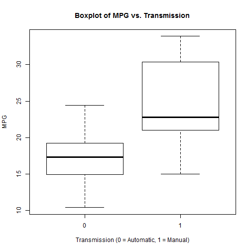

Data Products Presentarion - Shiny Application and Reproducible Pitch
========================================================
author: Delermando Branquinho Filho
date: august, 04 2016
autosize: true


========================================================

Course Project

* This is the final presentation for the Course Project of the “Developing data products” course
* This course is part of the “Data Science specialization”
* The project consists in two activities:
* Create a Shiny application
* Create a presentation in Slidify or Rstudio Presenter to pitch for the application.

========================================================

As an initial test, dependence of mpg on wt is analysed. box-scat A: Boxplot, B: Scatterplot of mpg against wt.

For the purpose of this analysis we use mtcars dataset which is a dataset extracted from the 1974 Motor Trend US magazine, and comprises fuel autonomy and 10 more aspects of automobile design and performance for 32 automobiles (1973-74 models). The table below shows a brief description of the variables in the dataset:


```r
data("mtcars")
head(mtcars)
```

```
                   mpg cyl disp  hp drat    wt  qsec vs am gear carb
Mazda RX4         21.0   6  160 110 3.90 2.620 16.46  0  1    4    4
Mazda RX4 Wag     21.0   6  160 110 3.90 2.875 17.02  0  1    4    4
Datsun 710        22.8   4  108  93 3.85 2.320 18.61  1  1    4    1
Hornet 4 Drive    21.4   6  258 110 3.08 3.215 19.44  1  0    3    1
Hornet Sportabout 18.7   8  360 175 3.15 3.440 17.02  0  0    3    2
Valiant           18.1   6  225 105 2.76 3.460 20.22  1  0    3    1
```

========================================================
According to the boxplot, automatic cars have lower MPG (and possibly lower variance in the data). Importantly, the relationships appear linear and no outliers which could affect correlation values are identified. The only aspect which is slightly problematic is the limited dataset size (n=32). It is noted that apparently most cars with automatic transmission also are heavier which possibly confounds the observation, this would be subject to further research.



=======================================================
The application can be found in 

https://delermando.shinyapps.io/ShinyAppDBF/

